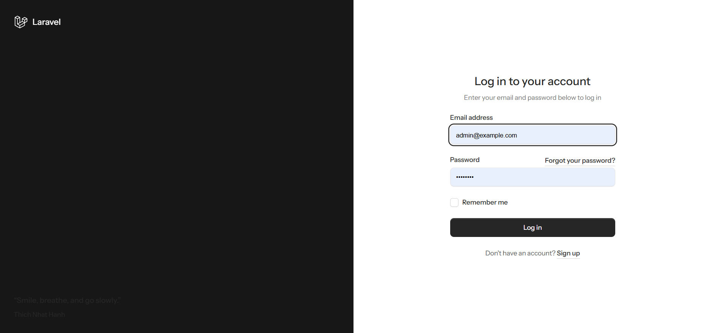
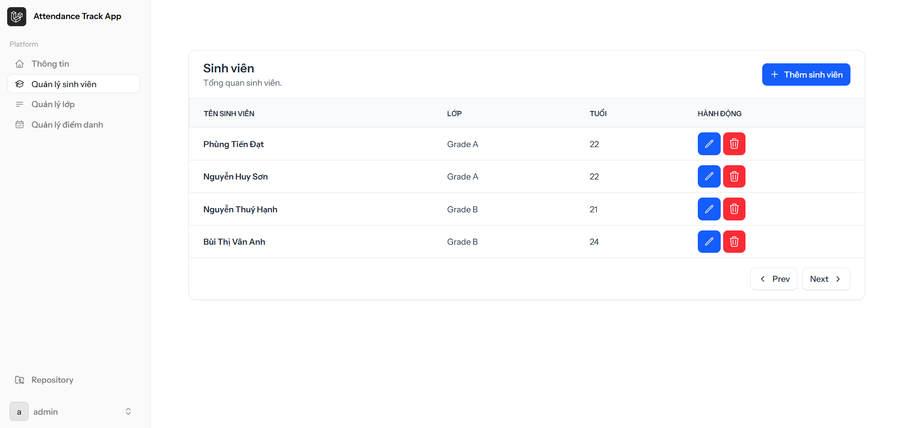
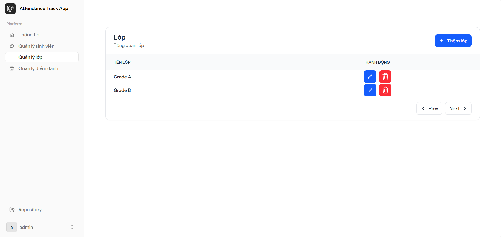
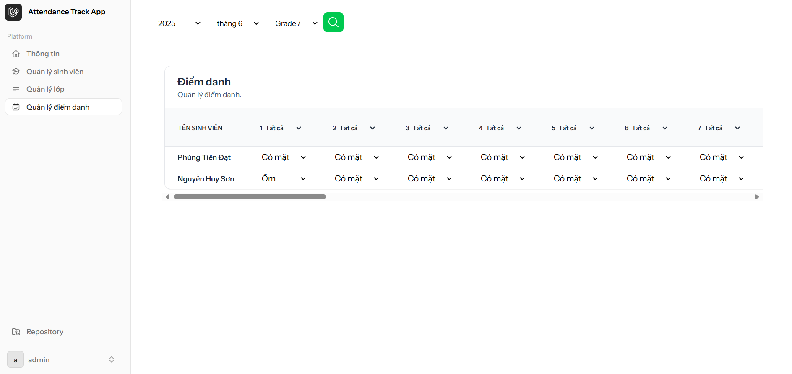
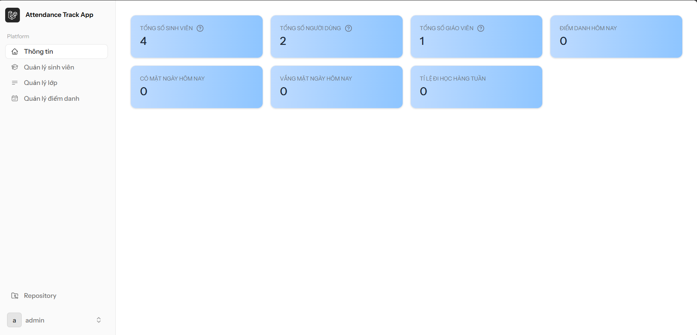

### Phùng Tiến Đạt 
### msv: 23010410
### Lớp: Thiết kế web nâng cao-1-3-24(COUR01.TH4)
# 📚 Project: Attendance Tracking App
#### Hệ thống quản lý điểm danh được phát triển bằng **Laravel** kết hợp với **Livewire**, hỗ trợ quản lý học sinh, lớp học, điểm danh và theo dõi thống kê.
---
## 🚀 Tính năng chính (Features Overview)
### 1. 🎭 User Roles & Authentication
- Hệ thống phân quyền người dùng:
  - **Admin**
  - **Teacher**
- Tích hợp hệ thống **Authentication** đầy đủ: `Login`, `Register`, `Logout`
#### 📸 Login
***

***
### 2. 🎓 Students & Grade Management
- **CRUD Students**: Thêm, Sửa, xoá, xem danh sách học sinh
- **CRUD Grades**: Quản lý lớp học (grades)
- **Phân bổ học sinh vào lớp** (Assign student to grades)
#### 📸 Students management
***

***
#### 📸 Grades management
***

***
### 3. 🕒 Attendance Management
- **Điểm danh học sinh** với 4 trạng thái:
    - Present (có mặt)
    - Absent (vắng mặt)
    - Sick (ốm)
    - other (khác)
- **Lọc dữ liệu điểm danh** theo:
    - Tháng (month)
    - Lớp học (grade)
#### 📸 Attendance management
***

***
### 4. ⚡ Livewire Components
- `AttendanceFilter`: Component giúp lọc điểm danh theo tháng và lớp học
- `AttendanceTable`: Hiển thị bảng điểm danh, cho phép tương tác qua action dropdown (Edit/Delete)
### 5. 📈 Dashboard
- Trang tổng quan thống kê: Tỷ lệ điểm danh, tình trạng học sinh
#### 📸 Dashboard
***

***
## ⚙️ Công nghệ sử dụng
| Công nghệ       | Mô tả                                   |
|----------------|------------------------------------------|
| Laravel        | Backend framework chính                  |
| Laravel Livewire | Tạo UI tương tác mà không cần JavaScript |
| Blade          | Template engine của Laravel              |
| Tailwind CSS   | CSS framework dùng để thiết kế UI        |
| MySQL - sqlite | Hệ quản trị cơ sở dữ liệu                |
| Laravel Breeze | Gói authentication cho Laravel           |

---
## 🧪 Hướng dẫn chạy project (Local Development)
### 1. Clone project
```bash
git clone https://github.com/datphung28-debug/Attendance-tracking-app.git
cd Attendance-tracking-app
```
### 2. Cài đặt dependencies
```bash
composer install
nmp install && npm rundev
```
### 3. Cấu hình **.env** và **Database**
3.1  **Chỉnh sửa file `.env`**
3.2  **Tạo APP_KEY:**
```bash
php artisan key:generate
```
3.3  **Cấu hình kết nối Database trong file `.env`:**
Mở file `.env` và cập nhật các thông tin sau cho database của bạn.

```dotenv
DB_CONNECTION=mysql
DB_HOST=127.0.0.1
DB_PORT=3306
DB_DATABASE=laravel #Tên database (có thể tạo trên xampp, mysql,...
DB_USERNAME=root
DB_PASSWORD=
```

3.4  **Chạy Migrations và Seeders:**
Sau khi cấu hình database, chạy các lệnh sau để tạo bảng và điền dữ liệu mẫu:
```bash
php artisan migrate:fresh --seed
```
Lệnh này sẽ xóa các bảng cũ, tạo lại các bảng mới và điền dữ liệu mặc định
### 4. Hoặc có thể dùng **sqlite**
 4.1 **Chỉnh sửa file `.env`**
   ```dotenv
   DB_CONNECTION=sqlite
   # DB_HOST=127.0.0.1
   # DB_PORT=3306
   # DB_DATABASE=laravel
   # DB_USERNAME=root
   # DB_PASSWORD=
   ```
 4.2 **Chạy Migrations và Seeders như ở trên**   
### 5. Chạy server
```bash
php artisan serve
```
### 6. Account
| Email    | Password    |
|----------|-------------|
| admin@example.com    | password    |
| teacher@example.com    | password    |
---
#### ❗Có thể tạo tài khoản **admin** trong file AdminSeeder.php (database\seeders\AdminSeeder.php)
